<picture>
  <source media="(prefers-color-scheme: dark)" srcset="./assets/header-dark.svg">
  <source media="(prefers-color-scheme: light)" srcset="./assets/header-light.svg">
  
</picture>

<p align="center">
  <picture>
    <source media="(prefers-color-scheme: dark)" srcset="https://readme-typing-svg.demolab.com?font=JetBrains+Mono&weight=600&size=20&duration=2600&pause=900&color=3DDC97&center=true&vCenter=true&width=640&height=48&lines=Native+Android+%E2%80%94+Kotlin+%C2%B7+Java+%C2%B7+Compose;Firebase+%2B+Node+backends+I+actually+own;Multi-tenant+SaaS%2C+live+in+production;Multi-agent+AI+on+local+models">
    
  </picture>
</p>

<p align="center">
  <a href="https://schooltracify.in"></a>
  <a href="https://www.upwork.com/freelancers/~0114354fb572f39a8f"></a>
  <a href="mailto:vivekbhadauriya.dev@gmail.com"></a>
  
</p>

<br>

### `>` whoami

I build **production systems** — the app, the backend it talks to, and the infrastructure that keeps both alive once real users arrive.

My core is native Android in **Kotlin and Java**, but I don't stop at the UI layer. I write the Cloud Functions behind my apps, design the data models they run on, ship the web dashboards that administer them, and own the release pipeline end to end. Systems fail at the seams between layers — so I work across all of them.

```kotlin
object Vivek {
    val role      = "Founder & Lead Developer @ CViant Technologies"
    val shipping  = "SchoolTracify — school ERP, live bus tracking, RFID attendance"
    val core      = listOf("Android", "Kotlin", "Java", "Jetpack Compose")
    val backend   = listOf("Firebase", "Cloud Functions", "Node.js", "PostgreSQL")
    val ai        = listOf("Multi-agent systems", "RAG", "Ollama (local models)")
    val studying  = "BCA @ Amity University"
    val based     = "Mainpuri, India · remote, worldwide"

    fun principle() = "The client is never trusted. Verify on the server."
}
```

<br>

### `>` featured build

<a href="https://schooltracify.in">
  <picture>
    <source media="(prefers-color-scheme: dark)" srcset="./assets/featured-dark.svg">
    <source media="(prefers-color-scheme: light)" srcset="./assets/featured-light.svg">
    
  </picture>
</a>

<table>
  <tr>
    <td width="33%" valign="top">
      <b>📍 Phone GPS, not hardware</b><br>
      <sub>Per-bus trackers were why schools walked away. Tracking moved onto the driver's phone — the hard part was a location cadence that doesn't kill the battery mid-route.</sub>
    </td>
    <td width="33%" valign="top">
      <b>🔐 Isolation is structural</b><br>
      <sub>Multi-tenant data where one school can never read another's records — enforced at the security-rule layer, not trusted to application code.</sub>
    </td>
    <td width="33%" valign="top">
      <b>💳 Server-verified billing</b><br>
      <sub>Razorpay subscriptions with tiered plans, coupons, invoicing and renewals. No payment state is ever taken from the client.</sub>
    </td>
  </tr>
</table>

<br>

### `>` toolbox

<table>
  <tr>
    <td width="130"><sub><b>MOBILE</b></sub></td>
    <td>
      <picture>
        <source media="(prefers-color-scheme: dark)" srcset="https://skillicons.dev/icons?i=androidstudio,kotlin,java,react&theme=dark&perline=12">
        
      </picture>
      <br><sub>Jetpack Compose · MVVM · Hilt · Room · Coroutines & Flow · WorkManager · React Native</sub>
    </td>
  </tr>
  <tr>
    <td><sub><b>BACKEND</b></sub></td>
    <td>
      <picture>
        <source media="(prefers-color-scheme: dark)" srcset="https://skillicons.dev/icons?i=firebase,gcp,nodejs,express,nestjs,postgres,prisma,redis&theme=dark&perline=12">
        
      </picture>
      <br><sub>Cloud Functions · Firestore & RTDB · security rules · REST · JWT · WebSockets · webhooks</sub>
    </td>
  </tr>
  <tr>
    <td><sub><b>WEB</b></sub></td>
    <td>
      <picture>
        <source media="(prefers-color-scheme: dark)" srcset="https://skillicons.dev/icons?i=nextjs,react,ts,js,tailwind,vercel&theme=dark&perline=12">
        
      </picture>
      <br><sub>Admin dashboards · role-based views · tables, filters, charts</sub>
    </td>
  </tr>
  <tr>
    <td><sub><b>AI & TOOLING</b></sub></td>
    <td>
      <picture>
        <source media="(prefers-color-scheme: dark)" srcset="https://skillicons.dev/icons?i=python,docker,githubactions,git,github,linux&theme=dark&perline=12">
        
      </picture>
      <br><sub>OpenAI · Gemini · AgentScope · Ollama · embeddings & RAG · tool calling · structured output</sub>
    </td>
  </tr>
  <tr>
    <td><sub><b>BUSINESS-CRITICAL</b></sub></td>
    <td><sub>Razorpay & Stripe · subscriptions · Google Maps SDK · realtime GPS & geofencing · FCM push · RFID hardware</sub></td>
  </tr>
</table>

<br>

### `>` commit pulse

<p align="center">
  <picture>
    <source media="(prefers-color-scheme: dark)" srcset="https://streak-stats.demolab.com?user=vivekbhadauriyadev&hide_border=true&background=0a0a0a&ring=3DDC97&fire=FFC53D&currStreakNum=EDEDED&sideNums=EDEDED&currStreakLabel=3DDC97&sideLabels=8B8B92&dates=55555C&stroke=1c1c1f&date_format=j%20M%5B%20Y%5D">
    
  </picture>
</p>

<p align="center">
  <picture>
    <source media="(prefers-color-scheme: dark)" srcset="https://github-readme-activity-graph.vercel.app/graph?username=vivekbhadauriyadev&bg_color=0a0a0a&color=8B8B92&line=3DDC97&point=FFC53D&area=true&area_color=3DDC97&title_color=EDEDED&hide_border=true&radius=16&custom_title=Contributions%20%E2%80%94%20last%2031%20days">
    
  </picture>
</p>

<p align="center">
  <picture>
    <source media="(prefers-color-scheme: dark)" srcset="https://raw.githubusercontent.com/vivekbhadauriyadev/vivekbhadauriyadev/output/snake-dark.svg">
    
  </picture>
</p>

<br>

### `>` let's build

<p>
  Have a system that needs to <b>survive real users</b> — an Android app, a backend, a SaaS with billing, or an AI agent that keeps data on your machine?
  I take work I can deliver, and say no to work I can't.
</p>

<p>
  <a href="mailto:vivekbhadauriya.dev@gmail.com"></a>
  <a href="https://www.upwork.com/freelancers/~0114354fb572f39a8f"></a>
  <a href="https://schooltracify.in"></a>
</p>

<picture>
  <source media="(prefers-color-scheme: dark)" srcset="./assets/footer-dark.svg">
  <source media="(prefers-color-scheme: light)" srcset="./assets/footer-light.svg">
  
</picture>
